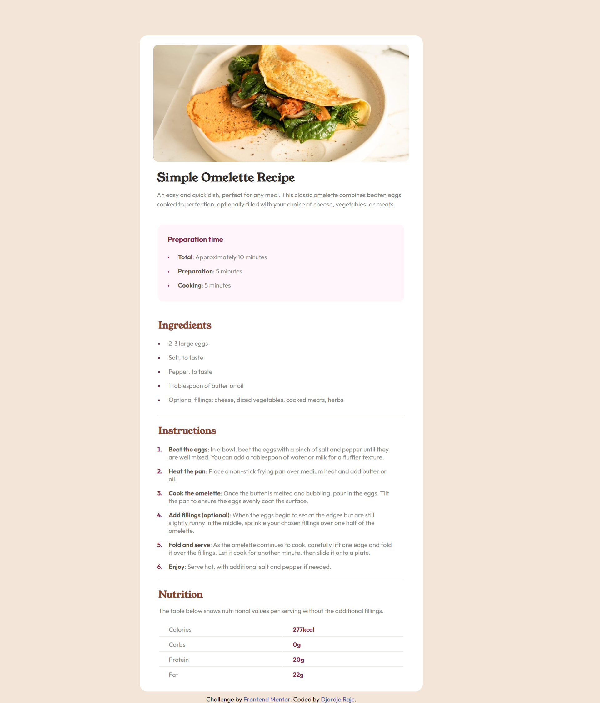

# Frontend Mentor - Recipe page solution

This is a solution to the [Recipe page challenge on Frontend Mentor](https://www.frontendmentor.io/challenges/recipe-page-KiTsR8QQKm). Frontend Mentor challenges help you improve your coding skills by building realistic projects.

## Table of contents

- [Overview](#overview)
  - [The challenge](#the-challenge)
  - [Screenshot](#screenshot)
  - [Links](#links)
- [My process](#my-process)
  - [Built with](#built-with)
  - [What I learned](#what-i-learned)
  - [Useful resources](#useful-resources)
- [Author](#author)

**Note: Delete this note and update the table of contents based on what sections you keep.**

## Overview

### Screenshot



### Links

- Solution URL: [Solution](https://your-solution-url.com)
- Live Site URL: [Live site](https://your-live-site-url.com)

## My process

### Built with

- Semantic HTML5 markup
- CSS custom properties
- Flexbox
- Mobile-first workflow
- SCSS

### What I learned

In this project, I learned how to style different lists and how to use tables.

```html
<table>
  <tr>
    <td>Calories</td>
    <td>277kcal</td>
  </tr>
  <tr>
    <td>Carbs</td>
    <td>0g</td>
  </tr>
  <tr>
    <td>Protein</td>
    <td>20g</td>
  </tr>
  <tr>
    <td>Fat</td>
    <td>22g</td>
  </tr>
</table>
```

```SCSS

ul {
  margin: rem(14) 0 0 0;
  padding: 0 rem(14);
  list-style: square;
}

li {
  text-align: start;
  color: var(--grey);
  font-size: rem(16);
  padding: rem(8) rem(12);
}

li::marker {
  color: var(--darkRaspberry);
  font-size: rem(12);
}

ol {
  padding: 0 rem(14);
  li::marker {
    font-weight: 700;
    font-size: rem(16);
  }
}
```

### Useful resources

- [list-style](https://css-tricks.com/almanac/properties/l/list-style/) - This helped me how to use the list-style.
- [::marker](https://css-tricks.com/almanac/selectors/m/marker/) - This helped me how to use ::marker to change the colors of the list.

## Author

- Website - [Djordje Rajc](https://blurryface1998.github.io/Personal-Portfolio/)
- Frontend Mentor - [@Blurryface1998](https://www.frontendmentor.io/profile/Blurryface1998)
